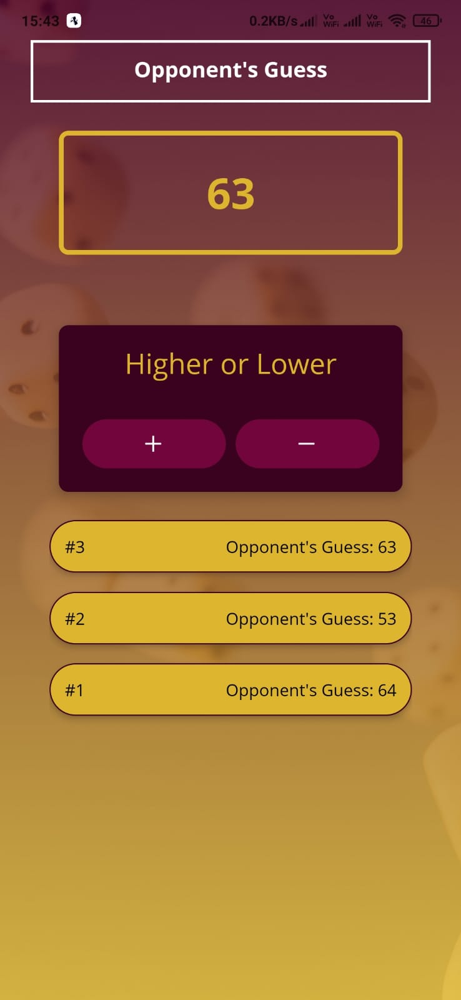
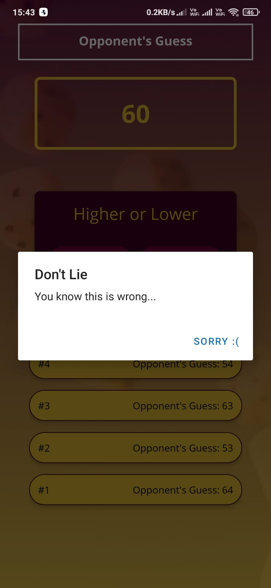
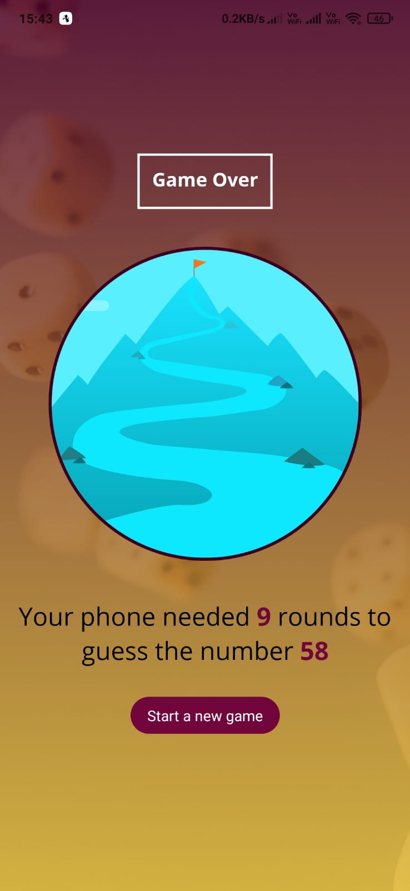

# Project Title

A simple cross platform guess game built in React-Native.

### How to play:

1. Enter a number between 1 and 99
2. The app will try to guess the correct number with some hints
   from your side.

### Steps to run:

1. Download Expo Go from Playstore/Appstore.

2. After cloning this project on your machine, run these commands in the project directory:

   `npm install`

   `npm start`

3. You'll see a QR code in the terminal logs, for Android scan
   the QR code via Expo Go app. For iOS, scan the QR code via the Camera app.

### App Screenshots:

